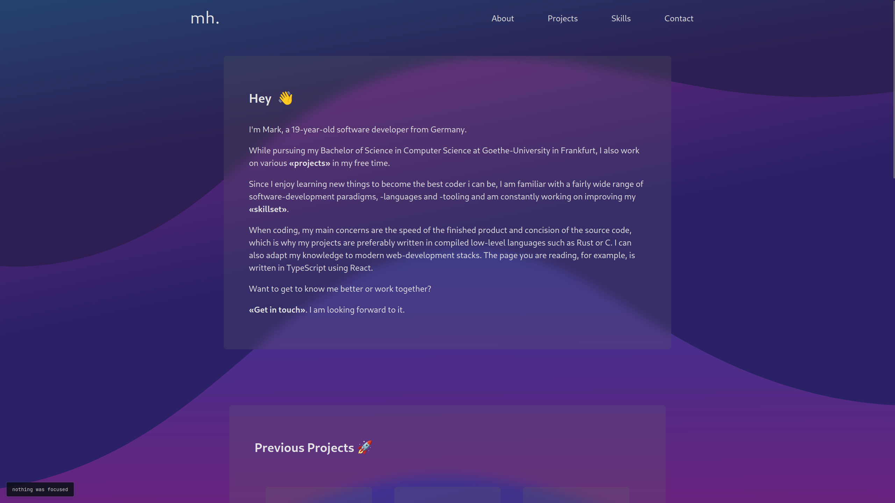

# 🌐 simple portfolio page

A simple, nice-looking portfolio page using TypeScript and React.


## Preview

The page layout is kept simple, with a basic *abstract* look and feel to it.




## Installation

This project was developed using `node v20.8.0` and `npm v10.1.0`.
To avoid issues, you might want to [use nvm](https://github.com/nvm-sh/nvm#installing-and-updating) to install these versions.

With a working setup, simply clone the repo, install the dependencies and run a server.

```sh
git clone https://github.com/markichnich/simple-portfolio-page
```
```sh
cd simple-portfolio-page && npm install
```
```sh
npm start # development server using webpack.
```

